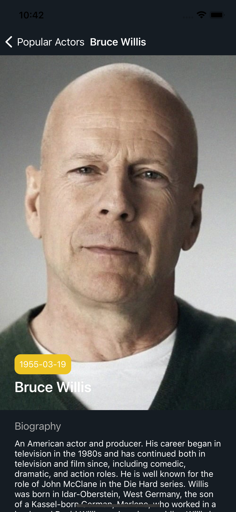

# The MovieDB App
PADC 11 iOS Full Term Course - Movie App using [MovieDB](https://developers.themoviedb.org/3) API.
This project was used to discuss the following topics

## Discussed Topics
* [Data Layer / Network Layer](https://github.com/thethtun/PADC-11-MovieApp) - Use this branch to see how data layer is set up.
* [Using CoreData as persistent layer](https://github.com/thethtun/PADC-11-MovieApp/tree/feature/setup-core-data) - it includes core data integration
* [Using Realm as persistent layer](https://github.com/thethtun/PADC-11-MovieApp/tree/feature/setup-realm) - it includes realm integration
* [Refactor using RxSwift](https://github.com/thethtun/PADC-11-MovieApp/tree/feature/setup-rx) - Configuring existing data flow using reactive programming framework RxSwift. 

## Screenshots
   

